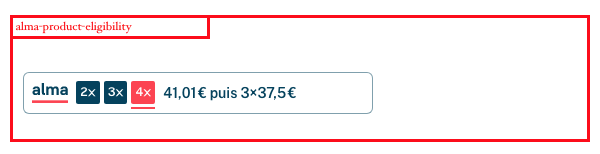
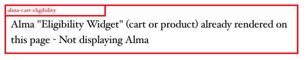
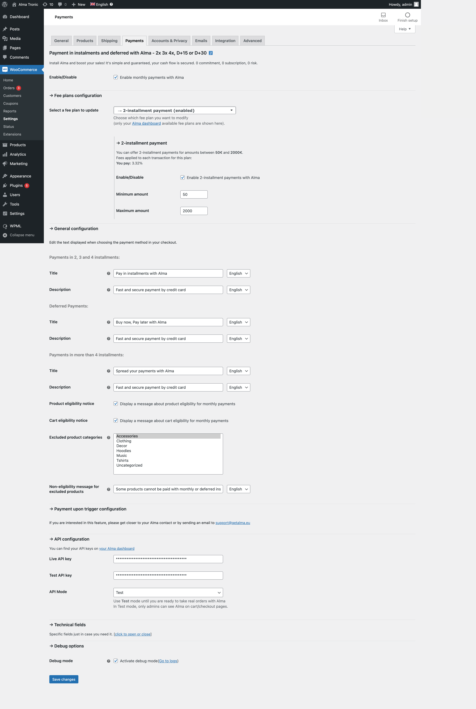
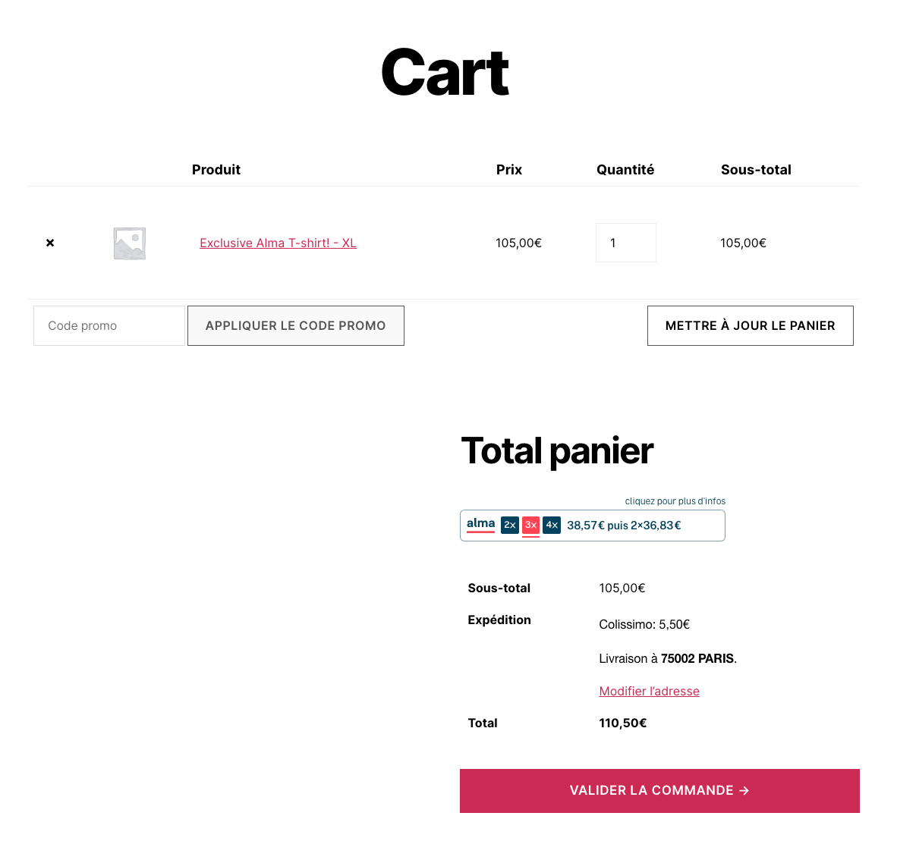
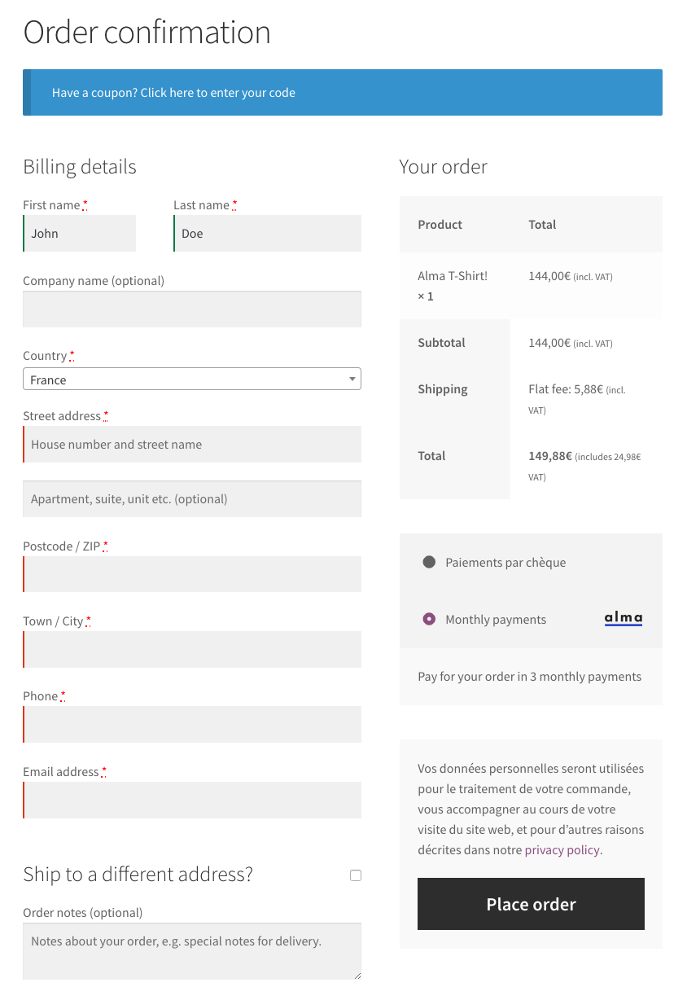
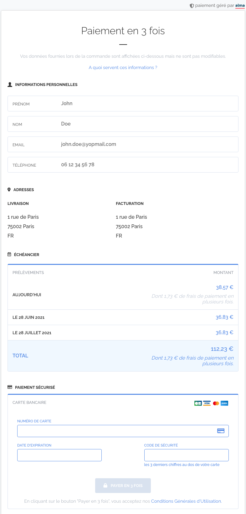
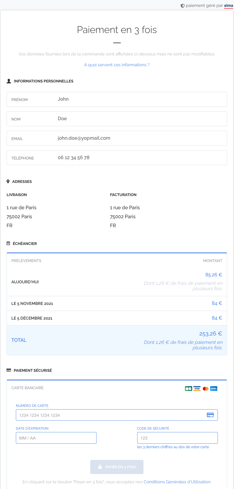
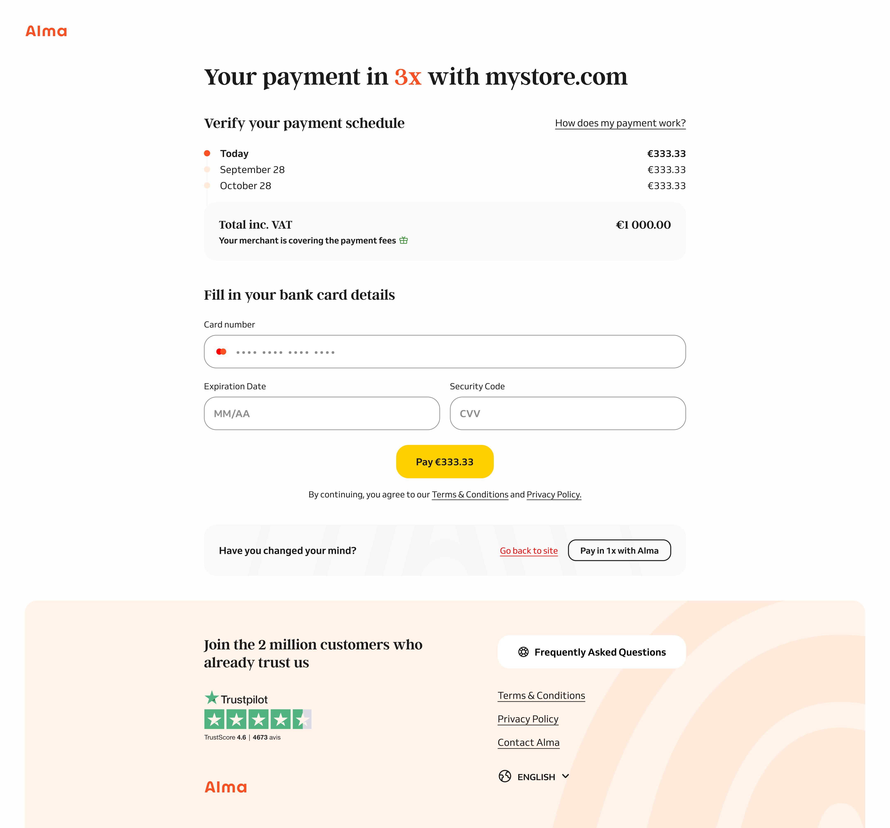

# Alma - Pay in installments or later for WooCommerce

- Contributors: almapayments, olance, francois-gomis, clairealma
- Tags: payments, payment gateway, woocommerce, ecommerce, e-commerce, sell, woo commerce, alma, monthly payments, split payments
- Requires at least Wordpress: 4.4
- Requires at least Woocommerce: 3.0.0
- Tested up to Wordpress: 6.2.2
- Tested up to Woocommerce: 7.8.0
- Requires PHP: 5.6
- Stable tag: 4.3.0
- License: GPLv3
- License URI: https://www.gnu.org/licenses/gpl-3.0.html
- Support: support@getalma.eu
- Documentation: https://docs.almapay.com/docs/woocommerce

This plugin adds a new payment method to WooCommerce, which allows you to offer monthly payments to your customer using Alma.

## Description

[Alma](https://almapay.com) is a service to provide merchants with an **easy** and **safe** monthly payments solution.
Let your customers pay for their purchases at their own pace! You'll receive the funds instantly, and your customer will pay later over a few monthly instalments.

This plugin integrates Alma into WooCommerce by adding a new payment method that you can activate to offer monthly payments to your customers.

## Installation

### Prerequisites

You first need to create your merchant account on [dashboard.getalma.eu](https://dashboard.getalma.eu) and activate your account.

### Configuring the plugin

After installing the plugin, go to WooCommerce settings and activate the new Alma payment method.
You should be redirected to the payment method settings upon activation.

Fill in the API keys for your account, which you can find on your dashboard\'s [security page](https://dashboard.getalma.eu/security).

After you save your API keys, you\'ll have access to different settings to control what the plugin should display on the Cart and Checkout pages.
We advise you to stay in \"Test\" mode until you\'re happy with your configuration and are ready to accept payments from your customers.

Once everything is properly set up, go ahead and switch to \"Live\" mode!

## Shortcodes

### Definitions

If you'd like to have more control on the position of the Alma badge on your store, you can deactivate the option in your **payment method settings** and use shortcodes directly into your themes templates, with a WooCommerce hook or into the `wp_post.short_description` for example.

It is also possible to use the shortcodes directly into your Posts, Pages or any other WordPress native displayed content.

There are two shortcodes available:
1. `[alma-product-eligibility]` will display the Alma badge for a product's eligibility
2. `[alma-cart-eligibility]` will display the Alma badge for the cart eligibility

#### Admin settings to disable

For the Cart Eligibility


For the Product Eligibility


### Usage

#### Alma Product Eligibility

- In a Product page, you should just add the shortcode without parameters (product will be found in the WordPress context) :
   `[alma-product-eligibility]`
- In a Page, Post or any other WordPress native displayed content, you have to add the id (__product_id__) parameter into the shortcode :
   `[alma-product-eligibility id=10]`
- It is also possible to inject the badge using hooks. Here for example, into the Product summary with a WooCommerce hook (add the following code into your Theme's `functions.php`):
```php
<?php
// ...
add_action( 'woocommerce_before_single_product_summary', 'inject_alma_product_eligibility_into_product' );
function inject_alma_product_eligibility_into_product() {
    echo do_shortcode( '[alma-product-eligibility]' );
}
// ...
```

#### Alma Cart Eligibility

- In a Page, Post or any other WordPress native displayed content, you just have to use the `[alma-cart-eligibility]` shortcode.
- It is also possible to inject the badge using hooks - here for example, into the Cart page with a WooCommerce hook (add the following code into your Theme's `functions.php`):
```php
// ...
add_action( 'woocommerce_after_cart_table', 'inject_alma_cart_eligibility_into_cart' );
function inject_alma_cart_eligibility_into_cart() {
    echo do_shortcode( '[alma-cart-eligibility]' );
}
// ...
```

#### Shortcode optional attributes and content

1. HTML class attribute

   You can customize rendering of the widget by adding your own HTML class attribute, using the shortcode `class` attribute. e.g:
   ```txt
   [alma-cart-eligibility class=my-website-amazing-content-style-class]
   ```
1. Content

   You can add a content between opening & closing shortcode tags. This content will be displayed into a `div.alma_wc_content`
   HTML element before the injected Widget. e.g:
   ```txt
   [alma-product-eligibility id=10]My Amazing Content about My Wonderfull Product[/alma-product-eligibility ]
   ```

   You can also add another shortcode into Widget shortcode (here the WooCommerce `product` shortcode):
   ```txt
   [alma-product-eligibility id=10][product id=10][/alma-product-eligibility ]
   ```
1. Debug

   Each shortcode can be debugged with a `debug=on` attribute. This will display a visual container with a message that
   will explain why the badge is not displayed. Use this option if you don't see the widget on a page you added the
   shortcode in. e.g: `[alma-product-eligibility id=10 debug=on]`

   
   

### Limitation

**<u>Only one Alma badge</u> can be displayed in a webpage.**

If the badge is injected twice or more in a Post, Page, Product, Cart or anywhere:
the second and following will not be displayed.

## Screenshots








## Contributing

- Clone the repository from https://github.com/alma/alma-woocommerce-gateway in you wp-content/plugins/alma-gateway-for-woocommerce folder
- Run `composer install` to install dependencies
- Create an account on http://dashboard.sandbox.getalma.eu/ to get an API key
- Fill your API key in plugin settings
- Visit the shop and add a product to the cart to see Alma in action

### Translations

To edit the translations, use [Poedit](https://poedit.net/)

- Open the `.pot` file and click on `Update from code`, then save
- Open the `.po` file and click on `Update from code`, add/update the translations, then save

### Build

To build extension for production run `./bin/build.sh`
